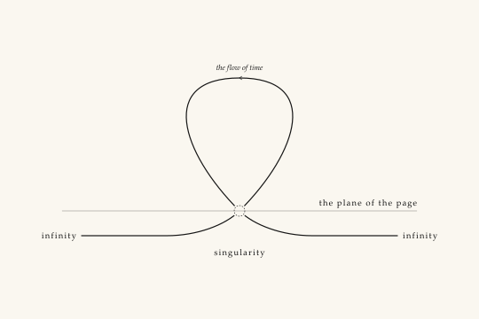
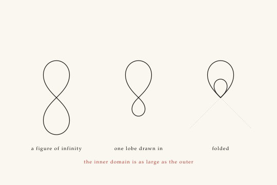
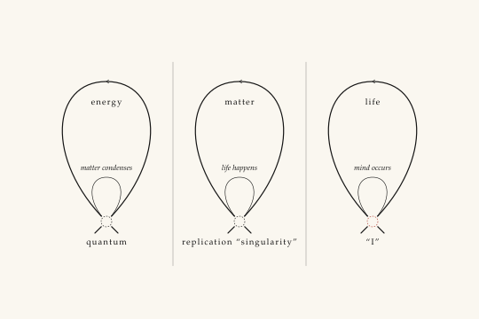
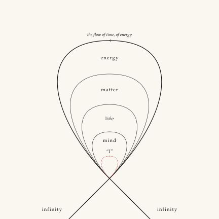
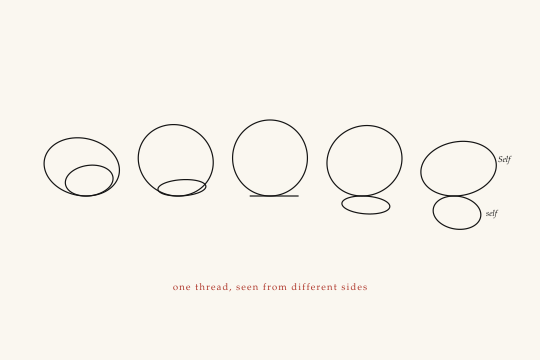
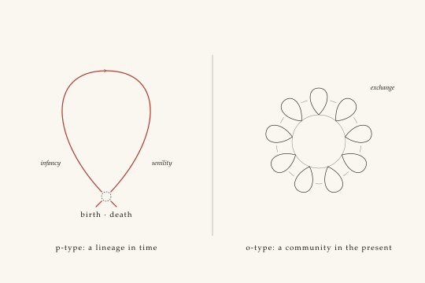
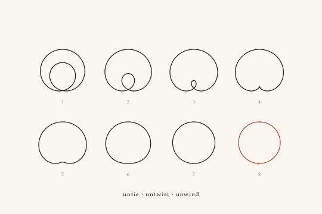
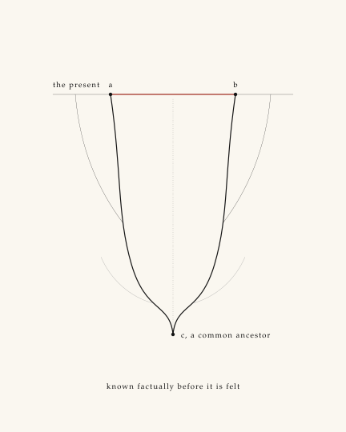

# Ontograph plates: Brief entries and prompts (roadmap #5)

Eight plates in the style of *Instructions to SOL Ultra — Illustration Brief*, for the Ontograph, which the Recapitulation does not yet illustrate. Each entry follows the Brief's form. To render a plate with an image model, prepend the style block verbatim, then the plate's PROMPT, then its format.

The SVGs in `plates/` are the reference drawings, built by `build.py`. The PROMPT is for anyone redrawing them. If a PROMPT and its SVG disagree, the SVG is right.

> **STYLE BLOCK.** Technical line drawing in the manner of the original Flatland illustrations and Edward Tufte's diagrams. Pure outline; no shading, no gradients, no textures, no 3D rendering, no photorealism. Warm off-white paper ground (#FAF7F0). Near-black ink (#141414); mid-grey (#8C8C8C) for secondary structure; a single dry vermilion (#B03A2E) accent used only where specified. Three line weights only: 1.2pt subject, 0.6pt secondary, 0.25pt hairline construction. Labels in small capitals, humanist serif, set horizontally beside what they name; no legend, no key, no title in the image. Ruled and compassed, not sketchy. Generous white margin.

---

### Plate O-I · The Pinched Loop

**Source.** ON-134 (p. 1), priority 1; ON-133 (p. 1). *“Another way of looking at this is to recognize the plane cut by this paper.”*

**The claim.** The universe is a loop in time that touches the page at a single point.

**Construction.** A hairline rule, the plane of the page seen edge-on. Standing on it, one loop at subject weight. It crosses itself where it meets the rule, and both strands run on under the rule to left and right until they leave the drawing. The crossing is a Horizon: the strands enter the dashes and are not drawn inside. One chevron at the top gives the direction of time.

**Ink.** Loop and strands 1.2pt. Rule hairline. Horizon 0.6pt black. No accent.

**Labels.** THE PLANE OF THE PAGE; INFINITY at both ends; SINGULARITY under the Horizon; italic *the flow of time* over the chevron.

**Forbid.** A burst, glow or radiance at the singularity. Any mark inside the Horizon. Arrows anywhere but the one chevron.

**PROMPT.** A single smooth loop standing on a fine horizontal rule, crossing itself at the one point where it touches the rule; from the crossing both strands curve down and run horizontally beneath the rule to left and right, labeled INFINITY at each end. The crossing is a small dashed circle enclosing nothing, labeled SINGULARITY beneath. One small open chevron at the top of the loop pointing left, with the italic words the flow of time. The small capitals THE PLANE OF THE PAGE on the rule at the right. Landscape format.

**Note on the redrawing.** The notebook draws the page's plane dashed. Here it is a hairline rule, because the Brief keeps dashes for Horizons and hidden edges. The singularity becomes the Horizon of Plates VIII and X, which is what ties the Ontograph into the Recapitulation.

---

### Plate O-II · Foldings of Infinity

**Source.** ON-153 (p. 8), priority 2. *“These layers are all connected, rightly thought of as foldings of infinity — as such the inner domain is as large as the outer.”*

**The claim.** The nested loop is the figure of infinity with one lobe folded inside the other.

**Construction.** Three stations of one curve, all the same size, crossing at the same height. (1) A true lemniscate standing upright. (2) The same curve with its lower lobe at half size. (3) That lobe folded up inside the upper one. It keeps the crossing's two 45° tangents, so it nests without touching. Dotted hairlines continue the tangents downward from station 3, where the lobe used to run.

**Ink.** Curves 1.2pt. Dotted continuations hairline. The sentence beneath in vermilion.

**Labels.** A FIGURE OF INFINITY · ONE LOBE DRAWN IN · FOLDED; beneath, in vermilion, THE INNER DOMAIN IS AS LARGE AS THE OUTER.

**Forbid.** The ∞ sign as a typographic ornament. Arrows between stations; the sequence is the argument.

**PROMPT.** Three equal stations in a row. First, an upright figure-eight lemniscate crossing at its center. Second, the same figure with its lower lobe drawn at half size. Third, that small lobe folded up inside the upper lobe, touching it only at the crossing point; from that point two fine dotted lines run down and outward at 45 degrees. Beneath the stations, in small capitals: A FIGURE OF INFINITY, ONE LOBE DRAWN IN, FOLDED. Centered below, in small capitals and dry vermilion: THE INNER DOMAIN IS AS LARGE AS THE OUTER. Landscape format.

**Note on the redrawing.** Station 3 is the unit every later plate is built from. The lemniscate is exact (Bernoulli). Stations 2 and 3 are the same point set, scaled and reflected.

---

### Plate O-III · The Chain

**Source.** ON-135, ON-136, ON-137 (p. 2), all priority 1. *“Within which matter condenses … within which life happens … within which mind occurs.”*

**The claim.** Each level is born from a pinch in the level before it.

**Construction.** Three panels, divided by hairline rules. Each holds one loop at subject weight, pinched at a Horizon, with a small loop at secondary weight born from the same pinch. The small loop of each panel is the large loop of the next. The reader supplies the magnification; nothing is drawn between panels.

**Ink.** Large loops 1.2pt; small loops 0.6pt; Horizons 0.6pt, the last one (the “I”) in vermilion.

**Labels.** ENERGY · MATTER · LIFE inside the large loops; italic *matter condenses*, *life happens*, *mind occurs* over the small ones; QUANTUM, REPLICATION “SINGULARITY”, “I” under the Horizons.

**Forbid.** Lists of galaxies, cells, species or stages of learning around the loops; they belong in the caption. Connecting arrows between panels.

**PROMPT.** Three equal panels divided by fine vertical rules. In each, a tall smooth loop that crosses itself at the bottom, where a small dashed circle encloses nothing; from the same crossing a much smaller loop rises inside it. Inside the large loops, the small capitals ENERGY, MATTER, LIFE; above the small loops, the italic words matter condenses, life happens, mind occurs. Under the three dashed circles: QUANTUM; REPLICATION “SINGULARITY”; “I” — the third dashed circle in dry vermilion. Landscape format.

**Note on the redrawing.** The notebook's third link is pinched at the “I”, and so is this one. The next plate folds the chain into one figure, and there the “I” moves to the centre.

---

### Plate O-IV · The Ontograph

**Source.** ON-138 (p. 3), priority 1, the key reference image. *“In the center we have the mind's ‘I,’ and yet at all times, identification with the universal and even infinite level is possible, by turning awareness around and sending it ‘back the way you came.’”*

**The claim.** Energy, matter, life and mind are one loop folded four times, and the one who looks is at the centre, never among the things shown.

**Construction.** Four loops sharing one pinch point, nested without touching, because they share the pinch's two tangents. The outermost strands cross at the pinch and run off the bottom edge of the page: the one place in the set where a line leaves the margin, as the notebook asks (“we draw lines running off the page to emphasize the fact that infinity is necessarily connected”). The innermost loop is a Horizon in the shape of a loop.

**Ink.** Energy 1.2pt; matter, life, mind 0.6pt; the “I” as vermilion dashes. This is the same vermilion Horizon as Plate IX, the event horizon of perception.

**Labels.** ENERGY · MATTER · LIFE · MIND in the bands between loops; italic “I” beside the dashed loop, never inside it; INFINITY at the ends of the strands; italic *the flow of time, of energy* over the chevron.

**Forbid.** A face, eye, figure or letter inside the dashed loop. Colour-coding the levels. Concentric circles; the loops must be pinched.

**PROMPT.** Four smooth nested loops of decreasing size, all passing through one shared point near the bottom of the frame and nesting without touching elsewhere; the outermost is heavier and its two strands cross at the shared point and run down off the bottom edge, labeled INFINITY. Innermost, a fifth small loop through the same point drawn as dry vermilion dashes, enclosing nothing, with an italic “I” beside it. In the bands between loops, the small capitals ENERGY, MATTER, LIFE, MIND. A small chevron at the top of the outer loop pointing left, with the italic words the flow of time, of energy. Square format.

**Note on the redrawing.** The notebook also pinches the loops at the top and sets a dashed INFINITY line over them. This plate keeps one pinch, so that it reads as the first singularity, and sends infinity out through the strands, as on p. 1.

---

### Plate O-V · One Thread, Seen From Different Sides

**Source.** ON-145 (p. 7), priority 1; ON-144 (p. 7). *“The Ontograph appears to capture the sense of separation of self and other, subject and object. But this is an illusion brought on by the viewing angle.”*

**The claim.** Self containing self, and self apart from Self, are one thread seen from two sides.

**Construction.** One rigid wire figure, drawn five times as it turns. The figure is a large loop and a small loop through the same point, in planes at right angles to each other. From the first side the small loop sits inside the large one (a 0 with an o in it, the notebook's Self containing self). Turned, the small loop narrows to a line at the base (a 6), then swings out beneath (an 8). The projection is computed, not sketched, so it is one object throughout.

**Ink.** All 1.2pt. The sentence beneath in vermilion.

**Labels.** Italic *Self* and *self* on the last station only, where they read apart; beneath, in vermilion, ONE THREAD, SEEN FROM DIFFERENT SIDES.

**Forbid.** Motion lines, arrows or ghosting between stations. Faces or figures for self and other.

**PROMPT.** Five equal stations in a row showing one wire figure rotating: a large loop and a small loop joined at a single point at the base. In the first station the small loop sits inside the large one; across the sequence it narrows to a line and then swings down beneath the large loop, so the last station reads as a figure eight. Italic Self and self beside the two loops of the last station. Centered beneath, in small capitals and dry vermilion: ONE THREAD, SEEN FROM DIFFERENT SIDES. Landscape format.

**Note on the redrawing.** The notebook's “apparent knots in the thread” are left out. One thread is enough for the claim, and the Brief allows one idea per plate.

---

### Plate O-VI · P-type and O-type

**Source.** ON-151 and ON-150 (p. 8), both priority 1; ON-148 (p. 8). *“The O-type emphasizes energetic exchange in the present … the P-type can be scaled down to an individual's history, emphasizing the temporal dimension.”*

**The claim.** The same loop read in time is a lifetime; read in the present, it is a community.

**Construction.** Two panels divided by a hairline rule. Left: one loop pinched at a Horizon where birth and death are the same point, time running up through infancy, over the top and down to senility. Right: nine small loops, each pinched on one shared hairline ring, with a hairline arc of exchange between each pair of neighbours.

**Ink.** The lifetime loop 1.2pt vermilion: the reader's own line, drawn as a loop. The community 0.6pt black, the ring and arcs hairline. No one in the community is distinguished.

**Labels.** BIRTH · DEATH under the Horizon; italic *infancy*, *senility*, *exchange*; beneath the panels, P-TYPE: A LINEAGE IN TIME and O-TYPE: A COMMUNITY IN THE PRESENT.

**Forbid.** Faces, figures or names on the small loops. Lungs, noses or anatomy; the breath (ON-152) is a separate plate if it is ever drawn.

**PROMPT.** Two panels divided by a fine vertical rule. Left: one tall smooth loop in dry vermilion crossing itself at the bottom inside a small dashed circle labeled BIRTH · DEATH, with the italic words infancy and senility on either side and a small chevron at the top pointing right. Right: nine small identical loops standing out from a fine circle like petals, each crossing itself on the circle, with short fine arcs between neighbours and the italic word exchange. Beneath, in small capitals: P-TYPE: A LINEAGE IN TIME; O-TYPE: A COMMUNITY IN THE PRESENT. Landscape format.

**Note on the redrawing.** The notebook's P-type puts BIRTH/DEATH at the top. It is moved to the pinch at the bottom here, to match O-I to O-IV.

---

### Plate O-VII · Untie, Untwist, Unwind

**Source.** ON-154 and ON-155 (p. 9), both priority 1. *“Unwind the links in the ontogenetic chain … This is the point of meditation, untying the self.” — and, in Japanese, ほとけがほどけてくれるんだ.*

**The claim.** Pulled open, the knotted loop becomes one open circle.

**Construction.** Eight stations in two rows, all the same height, drawn from one family of curves (the limaçon, r = b + a cos θ, with a + b held constant). As a falls: the loop inside a loop (1–3); the inner loop pulled to a cusp and gone (4, the cardioid, the knot untied); a kidney shape whose dimple flattens (5–6); convex (7); a circle (8). The curves are computed, so each station follows exactly from the one before it.

**Ink.** Stations 1–7 1.2pt black; station 8 1.2pt vermilion with two chevrons: the sentence the plate proves. Station numbers hairline grey.

**Labels.** Figures 1–8; beneath, UNTIE · UNTWIST · UNWIND. The Japanese line goes in the caption, not the plate.

**Forbid.** Glow, radiance or a halo on the final circle. Anything drawn inside it.

**PROMPT.** Eight equal stations in two rows of four, each a single closed curve of the same height: first a loop with a smaller loop inside it, joined at the bottom; across the sequence the inner loop shrinks to a cusp and disappears, the curve becomes a kidney shape, its dimple flattens, and the last station is a plain circle drawn in dry vermilion with two small chevrons showing circulation. Small grey figures 1 to 8 beneath the stations; at the bottom, in small capitals: UNTIE · UNTWIST · UNWIND. Landscape format.

**Note on the redrawing.** The notebook's stations 5–7 open the curve into a horseshoe, a gap in the ring. The limaçon keeps it closed and reaches the same end. If the open ring matters (the “open circle”), stations 6–7 can be redrawn with a gap.

---

### Plate O-VIII · The Circle of Empathy

**Source.** ON-182 (p. 14), priority 1; ON-172 (p. 12). *“Any two peoples (A, B) can now perceive themselves as twigs on the same tree, with common ancestors (C) and a shared material being.”*

**The claim.** Two people traced back to a common ancestor make a closed loop, and it can be known before it is felt.

**Construction.** A hairline rule for the present. From two points on it, A and B, two worldlines descend as mirror images and meet at C. Each carries two hairline twigs: one that reaches the present (other kin) and one, in grey, that ended. The stretch of the present between A and B closes the loop. A dotted hairline from C to that stretch is the notebook's “loop completed”.

**Ink.** Worldlines 1.2pt black, identical. The closing stretch A–B 1.2pt vermilion, which is the present shell. Twigs hairline; the ended twigs grey.

**Labels.** THE PRESENT; A; B; C, A COMMON ANCESTOR; beneath, KNOWN FACTUALLY BEFORE IT IS FELT.

**Forbid.** Figures, faces or flags for A and B; they are points. Any asymmetry between the two lines. A heart or any sentiment.

**PROMPT.** Portrait. A fine horizontal rule near the top labeled THE PRESENT. Two small dots on it, labeled A and B; from each, a continuous heavier line descends, mirror images of each other, until they meet at a single dot low in the frame labeled C, A COMMON ANCESTOR. Each line puts out two fine twigs, one reaching up to the rule and one, in grey, stopping short. The stretch of the rule between A and B is heavier and dry vermilion. A fine dotted vertical runs from C up to it. At the bottom, in small capitals: KNOWN FACTUALLY BEFORE IT IS FELT. Portrait format.

**Note on the redrawing.** The notebook draws C in red. Here the red moves to the stretch of the present, because the Brief's accent marks the present and C is in the past. Rescan ON-182 (faint red and blue ink) before comparing the two.

---
